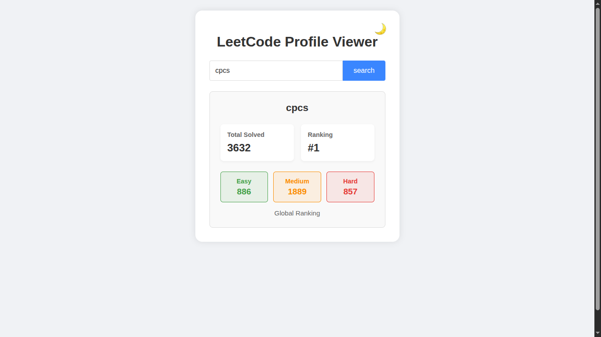
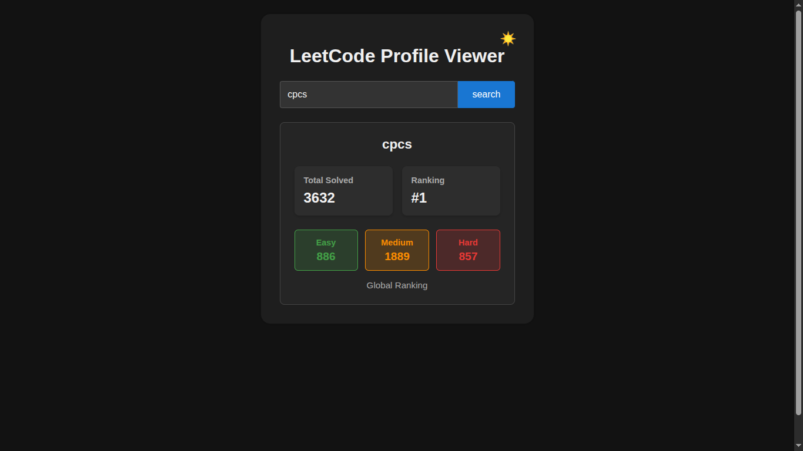

# LeetCode Profile Viewer

A simple web application to view LeetCode user statistics with light and dark mode support.

 | 

## Features

- View LeetCode user profile statistics
- Displays:
  - Total problems solved
  - Global ranking
  - Breakdown by difficulty (Easy, Medium, Hard)
- Toggle between light and dark mode
- Responsive design
- System preference-aware dark mode
- Persistent theme preference (saved in localStorage)

## How to Use

1. Enter a LeetCode username in the input field
2. Click "Search" button
3. View the user's statistics
4. Toggle dark/light mode using the moon/sun icon in the top-right corner

## Technical Details

- Built with HTML, CSS, and vanilla JavaScript
- Uses the [LeetCode Stats API](https://leetcode-stats-api.herokuapp.com/)
- Dark mode implemented with CSS variables and JavaScript
- No dependencies or frameworks required

## Installation

No installation required - just open `index.html` in a web browser.

## Browser Support

Works in all modern browsers (Chrome, Firefox, Safari, Edge).

## License

MIT

